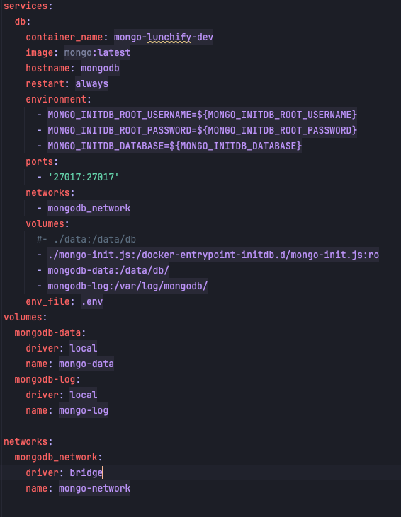

# be-ios-lunchify

This project is to show working knowledge of the development of ios application - this is BE side.

# MongoDB local setup

First you will need to install docker and mongodb on your local machine

```
Pull the MongoDB Docker Image!
docker pull mongodb/mongodb-community-server:latest

Run the Image as a Container!
docker run --name mongodb -p 27017:27017 -d mongodb/mongodb-community-server:latest -e MONGO_INITDB_ROOT_USERNAME=root -e MONGO_INITDB_ROOT_PASSWORD=secret 

Check that the Container is Running!
docker container ls

Install the mongosh package!
brew install mongosh
```

# Run docker-compose.yml

* To run this project you will need to setup mongo database via docker. It is important for you to
  have mongo installed on your local machine.
* You will need to create .env file in the root of the project and paste all properties from
  .env-example and setup your own user and database name
* Run commands for docker:

```
## Docker compose to run up all volumes and also mongo-init.js
docker compose -f docker-compose.yml up -d

## Remove docker container and all of data
docker compose down -v
```

* Picture below is showing how docker compose file was set up
  

# Reference links for development

```
## Spring boot with mongodb
https://docs.spring.io/spring-data/mongodb/reference/mongodb/template-api.html

## Services top-level elements
https://docs.docker.com/reference/compose-file/services/

## Docker Samples GitHub repo
https://github.com/dockersamples?q=&type=all&language=&sort=stargazers

## Docker quick start
https://docs.docker.com/compose/gettingstarted/
```